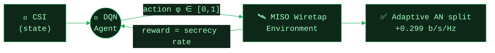
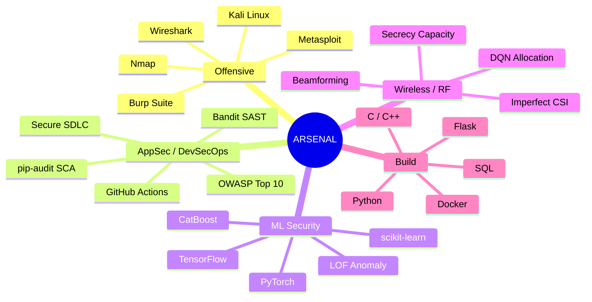
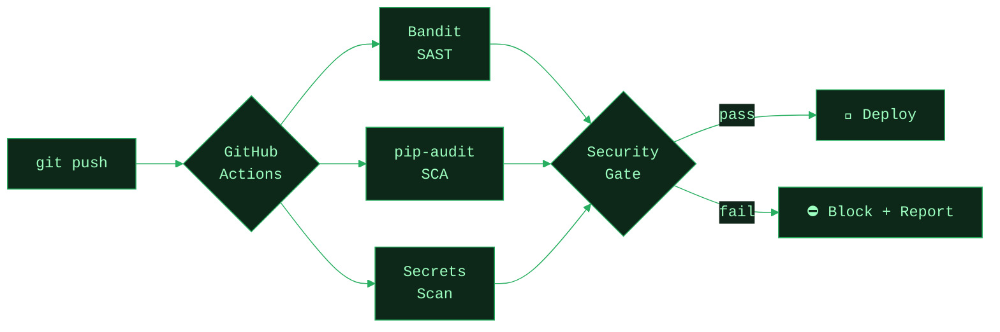
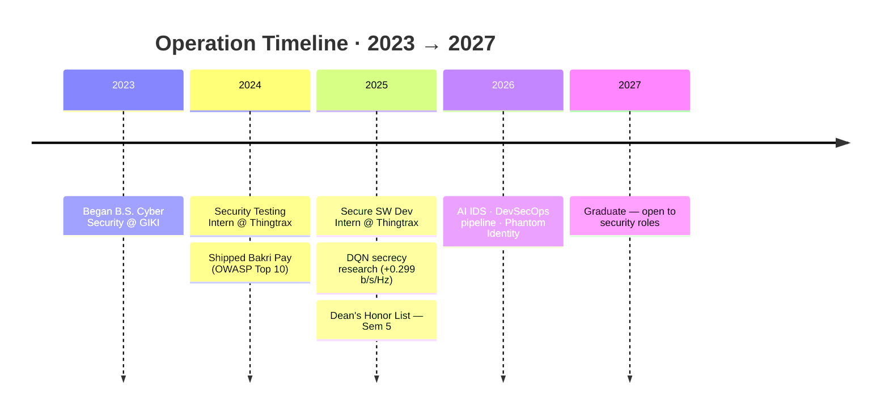

<!--
  ╔══════════════════════════════════════════════════════════════╗
  ║  kryptbakar · profile README                                   ║
  ║  Custom animated SVGs live in ./assets/  → commit that folder. ║
  ╚══════════════════════════════════════════════════════════════╝
-->

<div align="center">

<!-- ░░░ HERO: hand-authored animated CRT terminal (./assets/header.svg) ░░░ -->
<a href="https://creativefolio-nine.vercel.app/">
 alt="Muhammad Abubakar — Cyber Security Researcher" />
</a>

<br/>


<br/><br/>


&nbsp;

&nbsp;

&nbsp;


</div>

> [!NOTE]
> **`mission`** → Build systems that are *mathematically* harder to compromise. I don't stop at finding the bug — I model it, reproduce it, and engineer it out of existence.

---

## `> whoami`

```bash
┌──(kryptbakar㉿giki)-[~]
└─$ cat about.txt

Name     : Muhammad Abubakar
Role     : Final-year Cyber Security Undergraduate
School   : Ghulam Ishaq Khan Institute (GIKI) — Class of 2027
CGPA     : 3.2 / 4.00   ★ Dean's Honor List (5th Semester)
Focus    : Physical-layer Wireless Security · AppSec · DevSecOps · ML-Security
Industry : 2× Intern @ Thingtrax — Security Testing & Secure Software Dev
```

<details>
<summary><b><code>$ ls ~/identity/</code></b> &nbsp;— expand the dossier</summary>

<br/>

| `field` | `value` |
|:--|:--|
| 🎯 **Specialty** | DQN-based artificial-noise allocation for MISO wiretap channels |
| 🧪 **Research result** | **+0.299 bits/s/Hz** secrecy gain over fixed allocation at low SNR |
| 🏭 **Experience** | Security Testing & Secure SW Dev — *Thingtrax* (2×) |
| 🛠️ **Mindset** | Offensive recon → defensive engineering → provable hardening |
| 🌱 **Now learning** | Malware analysis · reverse engineering · adversarial ML |

</details>

---

## `> cat research/featured.md` 🛰️

<div align="center">

<!-- ░░░ hand-authored animated result panel (./assets/secrecy.svg) ░░░ -->


</div>

I train a **Deep Q-Network** to adaptively split transmit power between the information beam and **artificial noise (AN)** on a MISO wiretap channel — under **Rayleigh fading** with **imperfect CSI** — to maximise the *secrecy rate*, the throughput an eavesdropper provably **cannot** decode.

**The quantity being maximised — secrecy capacity:**

$$
C_s \;=\; \Big[\,\log_2\!\big(1+\gamma_b\big)\;-\;\log_2\!\big(1+\gamma_e\big)\Big]^{+}
$$

**The transmitted signal** — information beam + artificial noise, with the power split $\phi$ chosen by the learned policy:

$$
\mathbf{x}\;=\;\sqrt{\phi P}\;\mathbf{w}\,s\;+\;\sqrt{(1-\phi)P}\;\mathbf{z},
\qquad
\phi^{\star}=\pi_\theta(\text{CSI})\in[0,1]
$$

**How the agent learns it — the DQN / Bellman update:**

$$
Q(s,a)\;\leftarrow\;Q(s,a)\;+\;\alpha\Big[\,r+\gamma\max_{a'}Q(s',a')-Q(s,a)\,\Big]
$$

<sub>where γ_b, γ_e are the legitimate / eavesdropper SINRs, <b>w</b> the beamformer, <b>z</b> the AN vector, φ ∈ [0,1] the power-split action, and [·]⁺ = max(·, 0).</sub>

**Closed control loop:**



---

## `> tree ~/arsenal` ⚔️

> [!TIP]
> Mapped by intent — offense, defense, and the ML that powers both.



<div align="center">


<br/>

<br/>

<br/>


`#0D1117` &nbsp; `#27AE60` &nbsp; `#9DFFC0` &nbsp; <sub>← profile palette</sub>

</div>

---

## `> ./run operations/` 🎯

| Operation | What it does | Stack |
|:--|:--|:--|
| 🔬 **DQN Artificial-Noise Allocation** | RL agent splits power for max secrecy on a MISO wiretap channel — **+0.299 b/s/Hz** at low SNR. | `Python` `TensorFlow` `RL` |
| 🕵️ **Phantom Identity** | Manifest V3 extension spoofing Canvas / WebGL / Navigator / timezone fingerprints per session, with a live entropy dashboard. **Zero telemetry.** | `JavaScript` `MV3` `Privacy` |
| 🤖 **AI Intrusion Detection** | Hybrid **CatBoost + LOF** — supervised classifier *plus* unsupervised novelty detection. **1.6M samples in ~7.5 min**; catches unseen attack classes. | `CatBoost` `sklearn` |
| 🏦 **Bakri Pay** | Full-stack Flask MVC bank — Argon2/bcrypt, CSRF tokens, parameterised queries, authed REST. Full OWASP Top 10, validated in Burp. | `Flask` `OWASP` |
| ⚙️ **Secure CI/CD Pipeline** | Fail-fast security gates any repo can inherit *(diagram below)*. | `GitHub Actions` `SAST/SCA` |

<details>
<summary><b><code>$ cat operations/devsecops/pipeline.yml</code></b> &nbsp;— see the security gates</summary>

<br/>



</details>

---

## `> git log --trajectory` 📈



---

## `> telemetry --github` 📊

<div align="center">


&nbsp;


<br/>


<br/>


<br/>


</div>

---

## `> cat certs/*.crt` 🎓

<div align="center">


&nbsp;

<br/><br/>

&nbsp;

&nbsp;


</div>

---

## `> ./connect` 🕸️

<div align="center">

<a href="https://linkedin.com/in/muhammadabubakar"></a>
&nbsp;
<a href="mailto:abubakaramirwork@gmail.com"></a>
&nbsp;
<a href="https://creativefolio-nine.vercel.app/"></a>
&nbsp;
<a href="https://instagram.com/dumbutthehe"></a>

</div>

> [!IMPORTANT]
> 💬 **Ask me about** → OWASP Top 10 & secure SDLC · DevSecOps SAST/SCA gating · physical-layer secrecy capacity · XSS/SQLi/auth-bypass (and engineering them out) · CTFs, bug bounty & recon · ML for intrusion detection.

---

<!-- contribution snake (needs the snake GitHub Action — see setup notes) -->
<div align="center">
  
</div>

> [!CAUTION]
> All offensive tooling and research here is for **authorized, educational, and defensive** purposes only. Stay ethical. Hack legally. 🔐
